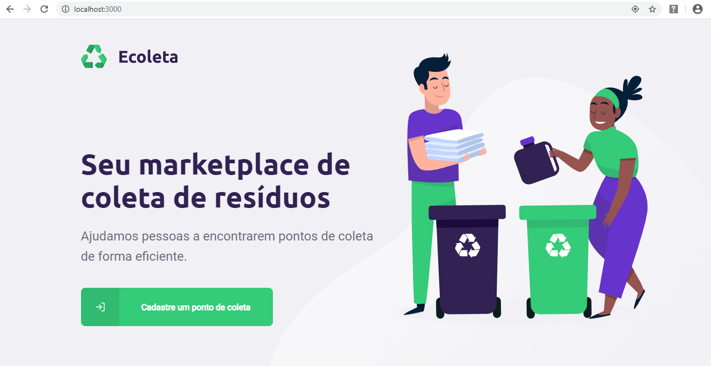
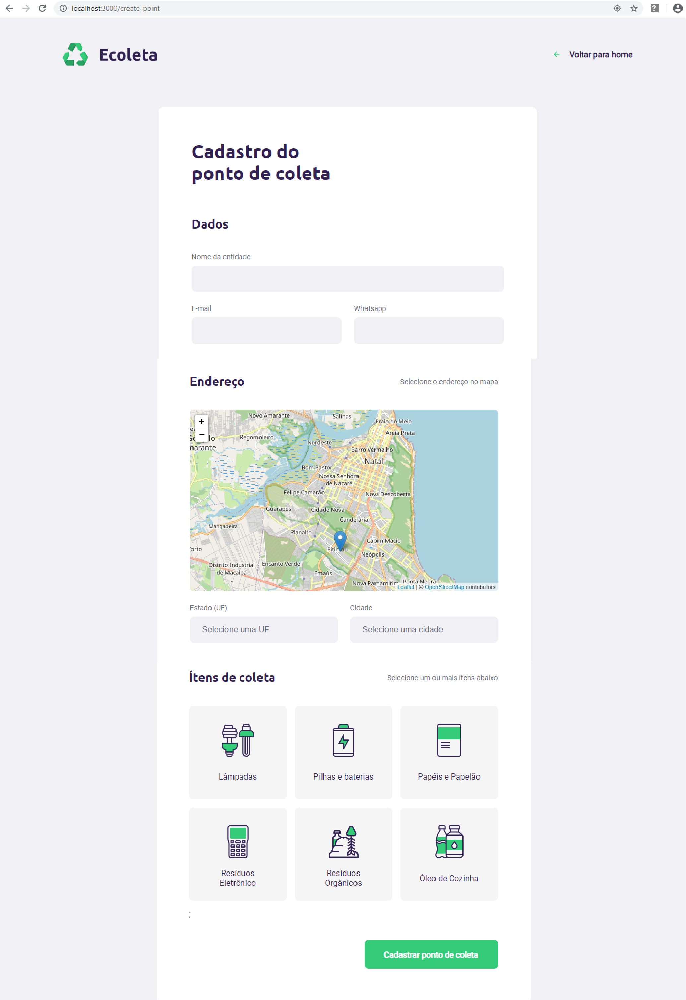

# NLW-ecoleta
> Projeto desenvolvido durante a semana da Next Level Week promovido pela Rockeatseat.

> O projeto consiste no desenvolvimento de um sistema que conecta empresas e entidades que coletam resíduos orgânicos ou inorgânicos à pessoas que precisam descartar esses resíduos.

## Conteúdo
* [Tecnologias utilizadas](#tecnologias-utilizadas)
* [Projeto web](#projeto-web)
* Projeto mobile - EM DESENVOLVIMENTO

## Tecnologias utilizadas
- [Node.js](https://nodejs.org/en/)
- [React](https://reactjs.org/)
- [React Native](https://reactnative.dev/)
- [Expo](https://expo.io/)

## Projeto web
- A parte web do projeto é onde as empresas fazem o cadastro no app.
- A aplicação utiliza para a interação com o mapa a API <a href="https://leafletjs.com/examples/quick-start/">Leaflet</a> e <a href="https://react-leaflet.js.org/">React-Leaflet</a>.
- Para selecionar o município com base na UF, foi utilizado a <a href="https://servicodados.ibge.gov.br/api/docs/localidades?versao=1">API de localidades do IBGE</a>

## Projeto mobile
